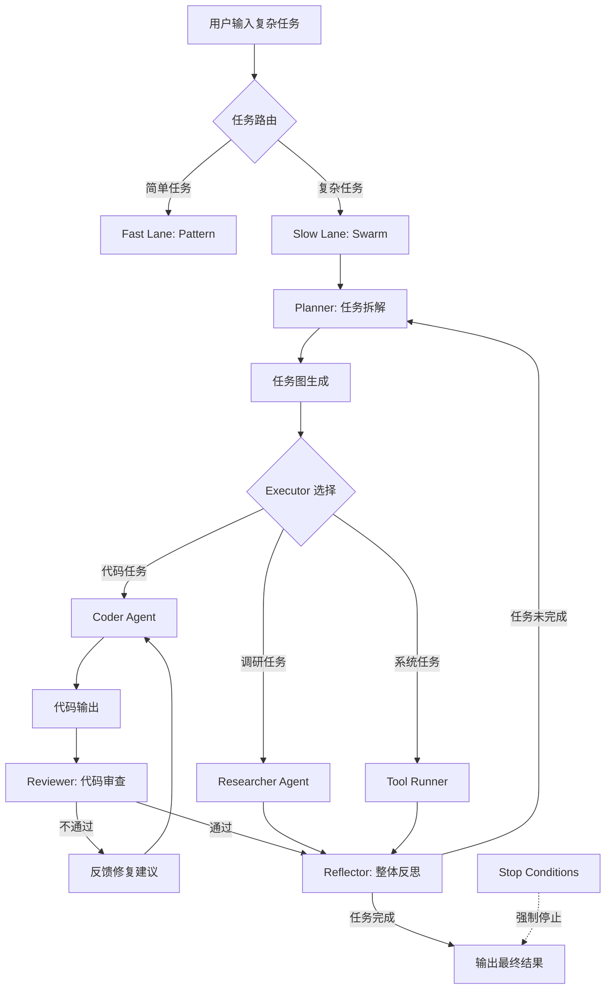

# MacCortex Phase 4 实施计划

**阶段名称**: Swarm Intelligence - 复杂任务编排与自纠错
**计划版本**: v1.0
**创建时间**: 2026-01-22
**预计工期**: 6 周（2026-01-22 ~ 2026-03-05）
**前置条件**: Phase 0.5 ~ Phase 3 已完成并通过验收

---

## 执行摘要

Phase 4 实现 MacCortex 的 **Slow Lane** 核心能力：通过 LangGraph 编排多个智能代理（Planner、Coder、Reviewer、Researcher），完成复杂的多步骤任务，支持自纠错和人机回环。

**核心目标**:
1. ✅ 实现 Plan → Execute → Reflect 循环工作流
2. ✅ 实现 Coder ↔ Reviewer 自纠错回路
3. ✅ 实现 Stop Conditions（最大迭代、预算、时间、用户中断）
4. ✅ 验收：完成一个可运行的小型项目（CLI 工具）并通过测试

**技术栈**:
- Python 3.10+ (Backend)
- LangGraph（状态机编排）
- Ollama/MLX（本地推理）
- Claude API（复杂推理备选）
- Swift/SwiftUI（前端 GUI）

---

## 1. Phase 4 架构概览

### 1.1 Slow Lane 工作流



### 1.2 核心组件

| 组件 | 职责 | 输入 | 输出 |
|------|------|------|------|
| **Router** | 任务分类（Fast/Slow） | 用户指令 + 上下文 | 路由决策 |
| **Planner** | 任务拆解与计划生成 | 复杂任务描述 | 子任务列表 + 验收标准 |
| **Coder** | 编写代码实现 | 任务需求 | 可执行代码 |
| **Reviewer** | 代码审查与测试 | 代码 + 测试用例 | 通过/失败 + 反馈 |
| **Researcher** | 调研与信息检索 | 调研问题 | 结构化信息 |
| **ToolRunner** | 执行系统工具 | 工具调用请求 | 执行结果 |
| **Reflector** | 整体质量检查 | 所有子任务结果 | 完成度评估 |
| **Stop Conditions** | 循环终止控制 | 当前迭代状态 | 继续/停止 |

---

## 2. 六周实施计划

### Week 1: LangGraph 基础设施与 Planner（2026-01-22 ~ 2026-01-28）

#### Day 1-2: 环境搭建与 LangGraph 集成

**交付物**:
- [x] Python 虚拟环境（`Backend/venv-phase4/`）
- [x] LangGraph 依赖安装（langgraph, langchain-core, langchain-anthropic）
- [x] Backend 项目结构调整

**目录结构**:
```
Backend/
├── src/
│   ├── orchestration/          # 新增：Swarm 编排
│   │   ├── __init__.py
│   │   ├── graph.py            # LangGraph 主图
│   │   ├── state.py            # 状态定义
│   │   └── nodes/              # 各个 Agent 节点
│   │       ├── __init__.py
│   │       ├── planner.py
│   │       ├── coder.py
│   │       ├── reviewer.py
│   │       ├── researcher.py
│   │       └── reflector.py
│   ├── patterns/               # 现有：Fast Lane
│   ├── utils/                  # 现有：配置、日志
│   └── main.py                 # FastAPI 主入口
└── tests/
    └── orchestration/          # 新增：Swarm 测试
```

**验收标准**:
```bash
cd Backend
python -m pytest tests/orchestration/test_graph_basic.py -v
# 预期：基础图创建和状态更新测试通过
```

---

#### Day 3-5: Planner Agent 实现

**核心功能**:
1. 接收用户复杂任务描述
2. 使用 LLM 拆解为子任务（3-10 个）
3. 为每个子任务定义验收标准
4. 生成任务依赖关系图

**代码示例**:
```python
# Backend/src/orchestration/nodes/planner.py

from langchain_core.messages import SystemMessage, HumanMessage
from langchain_anthropic import ChatAnthropic
from ..state import SwarmState

class PlannerNode:
    def __init__(self, model="claude-sonnet-4"):
        self.llm = ChatAnthropic(model=model, temperature=0.2)

    async def plan(self, state: SwarmState) -> SwarmState:
        """
        拆解复杂任务为子任务列表
        """
        user_task = state["user_input"]
        context = state.get("context", {})

        system_prompt = """
        你是一个专业的任务规划师。将复杂任务拆解为 3-10 个可执行的子任务。

        输出格式（JSON）:
        {
          "subtasks": [
            {
              "id": "task-1",
              "type": "code|research|tool",
              "description": "具体描述",
              "dependencies": [],
              "acceptance_criteria": ["标准1", "标准2"]
            }
          ],
          "overall_acceptance": ["整体验收标准"]
        }
        """

        messages = [
            SystemMessage(content=system_prompt),
            HumanMessage(content=f"任务: {user_task}\n\n上下文: {context}")
        ]

        response = await self.llm.ainvoke(messages)
        plan = self._parse_plan(response.content)

        state["plan"] = plan
        state["current_subtask_index"] = 0
        state["subtask_results"] = []

        return state

    def _parse_plan(self, content: str) -> dict:
        # JSON 解析逻辑
        import json
        return json.loads(content)
```

**验收标准**:
- [ ] Planner 能正确拆解任务："写一个贪吃蛇游戏"
- [ ] 生成的子任务包含 type、description、acceptance_criteria
- [ ] 能处理依赖关系（如：先写核心逻辑，再写 UI）

---

#### Day 6-7: 状态管理与检查点

**状态定义**:
```python
# Backend/src/orchestration/state.py

from typing import TypedDict, List, Dict, Any, Literal
from langgraph.graph import StateGraph

class SwarmState(TypedDict):
    # 输入
    user_input: str                     # 用户原始输入
    context: Dict[str, Any]             # 上下文（文件、屏幕OCR等）

    # 计划
    plan: Dict[str, Any]                # Planner 生成的计划
    current_subtask_index: int          # 当前执行到第几个子任务

    # 执行
    subtask_results: List[Dict]         # 每个子任务的执行结果
    current_code: str                   # Coder 当前生成的代码
    review_feedback: str                # Reviewer 反馈

    # 控制
    iteration_count: int                # 当前迭代次数
    total_tokens: int                   # 累计 Token 消耗
    start_time: float                   # 任务开始时间
    status: Literal["planning", "executing", "reviewing", "reflecting", "completed", "failed"]

    # 输出
    final_output: Dict[str, Any]        # 最终输出
    error_message: str                  # 错误信息（如果失败）
```

**检查点实现**:
```python
from langgraph.checkpoint.sqlite import SqliteSaver

# 在 graph.py 中
checkpointer = SqliteSaver.from_conn_string("checkpoints.db")

graph = StateGraph(SwarmState)
# ... 添加节点和边
compiled_graph = graph.compile(checkpointer=checkpointer)

# 支持暂停/恢复
config = {"configurable": {"thread_id": "task-123"}}
for step in compiled_graph.stream(initial_state, config=config):
    print(step)
    # 用户可以随时中断，下次从检查点恢复
```

**验收标准**:
- [ ] 状态能在节点间正确传递
- [ ] 检查点能保存到 SQLite
- [ ] 中断后能从检查点恢复

---

### Week 2: Coder ↔ Reviewer 自纠错回路（2026-01-29 ~ 2026-02-04）

#### Day 1-3: Coder Agent 实现

**核心功能**:
1. 根据子任务需求生成代码
2. 支持多语言（Python、Swift、Bash 等）
3. 输出可执行代码文件

**代码示例**:
```python
# Backend/src/orchestration/nodes/coder.py

import os
from pathlib import Path
from langchain_anthropic import ChatAnthropic
from ..state import SwarmState

class CoderNode:
    def __init__(self, workspace_path: Path):
        self.llm = ChatAnthropic(model="claude-sonnet-4", temperature=0.3)
        self.workspace = workspace_path

    async def code(self, state: SwarmState) -> SwarmState:
        """
        根据当前子任务生成代码
        """
        plan = state["plan"]
        current_index = state["current_subtask_index"]
        subtask = plan["subtasks"][current_index]

        # 检查是否有 Reviewer 反馈
        feedback = state.get("review_feedback", "")

        system_prompt = """
        你是一个专业的程序员。根据任务需求编写高质量、可执行的代码。

        要求：
        1. 代码必须完整可运行
        2. 包含必要的错误处理
        3. 添加清晰的注释
        4. 遵循最佳实践
        """

        if feedback:
            user_prompt = f"""
            任务: {subtask['description']}

            之前的代码有问题，审查反馈：
            {feedback}

            请修复问题并重新生成代码。
            """
        else:
            user_prompt = f"""
            任务: {subtask['description']}
            验收标准: {subtask['acceptance_criteria']}

            请生成完整代码。
            """

        response = await self.llm.ainvoke([
            {"role": "system", "content": system_prompt},
            {"role": "user", "content": user_prompt}
        ])

        code = self._extract_code(response.content)

        # 写入工作空间
        code_file = self.workspace / f"task_{current_index}.py"
        code_file.write_text(code)

        state["current_code"] = code
        state["current_code_file"] = str(code_file)
        state["review_feedback"] = ""  # 清空旧反馈

        return state

    def _extract_code(self, content: str) -> str:
        # 从 Markdown 代码块中提取代码
        import re
        match = re.search(r"```(?:python)?\n(.*?)```", content, re.DOTALL)
        if match:
            return match.group(1).strip()
        return content.strip()
```

**验收标准**:
- [ ] Coder 能生成可执行的 Python 代码
- [ ] 代码包含错误处理和注释
- [ ] 能根据 Reviewer 反馈修复问题

---

#### Day 4-5: Reviewer Agent 实现

**核心功能**:
1. 执行 Coder 生成的代码
2. 捕获运行时错误
3. 检查是否满足验收标准
4. 提供具体修复建议

**代码示例**:
```python
# Backend/src/orchestration/nodes/reviewer.py

import subprocess
import sys
from pathlib import Path
from ..state import SwarmState

class ReviewerNode:
    def __init__(self, workspace_path: Path):
        self.workspace = workspace_path

    async def review(self, state: SwarmState) -> SwarmState:
        """
        执行代码并审查结果
        """
        code_file = Path(state["current_code_file"])
        plan = state["plan"]
        current_index = state["current_subtask_index"]
        subtask = plan["subtasks"][current_index]

        # 1. 执行代码
        success, output, error = self._run_code(code_file)

        # 2. 使用 LLM 审查结果
        review_result = await self._review_with_llm(
            code=state["current_code"],
            output=output,
            error=error,
            acceptance_criteria=subtask["acceptance_criteria"]
        )

        if review_result["passed"]:
            # 审查通过，保存结果，进入下一个子任务
            state["subtask_results"].append({
                "subtask_id": subtask["id"],
                "code": state["current_code"],
                "output": output,
                "passed": True
            })
            state["current_subtask_index"] += 1
            state["status"] = "planning"  # 回到 Planner（或 Reflector）
        else:
            # 审查失败，提供反馈给 Coder
            state["review_feedback"] = review_result["feedback"]
            state["status"] = "executing"  # 重新交给 Coder
            state["iteration_count"] += 1

        return state

    def _run_code(self, code_file: Path) -> tuple[bool, str, str]:
        """
        在沙箱中执行代码
        """
        try:
            result = subprocess.run(
                [sys.executable, str(code_file)],
                capture_output=True,
                text=True,
                timeout=30,
                cwd=self.workspace
            )
            success = result.returncode == 0
            return success, result.stdout, result.stderr
        except subprocess.TimeoutExpired:
            return False, "", "执行超时（30秒）"
        except Exception as e:
            return False, "", str(e)

    async def _review_with_llm(
        self,
        code: str,
        output: str,
        error: str,
        acceptance_criteria: list
    ) -> dict:
        """
        使用 LLM 审查代码质量和输出
        """
        from langchain_anthropic import ChatAnthropic

        llm = ChatAnthropic(model="claude-sonnet-4", temperature=0)

        prompt = f"""
        请审查以下代码的执行结果：

        代码：
        ```python
        {code}
        ```

        标准输出：
        {output or "(无输出)"}

        错误输出：
        {error or "(无错误)"}

        验收标准：
        {chr(10).join(f"- {c}" for c in acceptance_criteria)}

        请判断：
        1. 代码是否成功运行？
        2. 是否满足所有验收标准？
        3. 如果不满足，具体哪里有问题？如何修复？

        输出格式（JSON）：
        {{
          "passed": true/false,
          "feedback": "具体反馈（如果不通过）"
        }}
        """

        response = await llm.ainvoke([{"role": "user", "content": prompt}])

        import json
        return json.loads(response.content)
```

**Coder ↔ Reviewer 循环**:
```python
# Backend/src/orchestration/graph.py

from langgraph.graph import StateGraph, END
from .state import SwarmState
from .nodes import PlannerNode, CoderNode, ReviewerNode

def create_swarm_graph():
    graph = StateGraph(SwarmState)

    # 添加节点
    graph.add_node("planner", PlannerNode().plan)
    graph.add_node("coder", CoderNode(workspace).code)
    graph.add_node("reviewer", ReviewerNode(workspace).review)

    # 定义边（循环逻辑）
    graph.set_entry_point("planner")

    graph.add_edge("planner", "coder")
    graph.add_edge("coder", "reviewer")

    # Reviewer 的条件边
    def after_review(state: SwarmState) -> str:
        if state["status"] == "executing":
            return "coder"  # 审查失败，返回 Coder
        elif state["current_subtask_index"] < len(state["plan"]["subtasks"]):
            return "coder"  # 下一个子任务
        else:
            return "reflector"  # 所有子任务完成

    graph.add_conditional_edges(
        "reviewer",
        after_review,
        {
            "coder": "coder",
            "reflector": "reflector"
        }
    )

    return graph.compile()
```

**验收标准**:
- [ ] Reviewer 能正确执行代码并捕获错误
- [ ] 如果代码有 Bug，能返回具体反馈给 Coder
- [ ] Coder ↔ Reviewer 循环最多迭代 3 次后强制退出

---

#### Day 6-7: Stop Conditions 实现

**四种停止条件**:
1. **最大迭代次数**：Coder ↔ Reviewer 循环超过 3 次
2. **Token 预算耗尽**：累计 Token 超过用户设定上限
3. **时间超限**：任务执行时间超过 10 分钟
4. **用户中断**：用户点击"停止"按钮

**代码示例**:
```python
# Backend/src/orchestration/nodes/stop_condition.py

import time
from ..state import SwarmState

class StopConditionChecker:
    def __init__(
        self,
        max_iterations: int = 3,
        max_tokens: int = 100000,
        max_time_seconds: int = 600
    ):
        self.max_iterations = max_iterations
        self.max_tokens = max_tokens
        self.max_time_seconds = max_time_seconds

    def should_stop(self, state: SwarmState) -> tuple[bool, str]:
        """
        检查是否应该停止

        Returns:
            (should_stop, reason)
        """
        # 1. 迭代次数
        if state["iteration_count"] >= self.max_iterations:
            return True, f"达到最大迭代次数 ({self.max_iterations})"

        # 2. Token 预算
        if state.get("total_tokens", 0) >= self.max_tokens:
            return True, f"Token 预算耗尽 ({self.max_tokens})"

        # 3. 时间限制
        elapsed = time.time() - state["start_time"]
        if elapsed >= self.max_time_seconds:
            return True, f"执行时间超限 ({self.max_time_seconds}秒)"

        # 4. 用户中断（通过外部标志检查）
        if state.get("user_interrupted", False):
            return True, "用户手动中断"

        return False, ""

# 在 Reviewer 节点中集成
class ReviewerNode:
    def __init__(self, workspace_path: Path):
        self.workspace = workspace_path
        self.stop_checker = StopConditionChecker()

    async def review(self, state: SwarmState) -> SwarmState:
        # ... 现有审查逻辑 ...

        # 检查停止条件
        should_stop, reason = self.stop_checker.should_stop(state)
        if should_stop:
            state["status"] = "failed"
            state["error_message"] = f"任务终止：{reason}"
            return state

        # ... 继续审查逻辑 ...
```

**验收标准**:
- [ ] 超过 3 次迭代后强制停止
- [ ] Token 超限后停止
- [ ] 时间超限后停止
- [ ] 用户中断能立即停止

---

### Week 3: Researcher & ToolRunner（2026-02-05 ~ 2026-02-11）

#### Day 1-3: Researcher Agent

**功能**:
1. 网络搜索（DuckDuckGo）
2. 文档检索（本地向量库）
3. API 调用（如 GitHub、天气等）

**代码示例**:
```python
# Backend/src/orchestration/nodes/researcher.py

from langchain_community.tools import DuckDuckGoSearchRun
from langchain_anthropic import ChatAnthropic
from ..state import SwarmState

class ResearcherNode:
    def __init__(self):
        self.search = DuckDuckGoSearchRun()
        self.llm = ChatAnthropic(model="claude-sonnet-4")

    async def research(self, state: SwarmState) -> SwarmState:
        """
        根据子任务进行调研
        """
        plan = state["plan"]
        current_index = state["current_subtask_index"]
        subtask = plan["subtasks"][current_index]

        if subtask["type"] != "research":
            # 跳过非调研任务
            return state

        # 1. 搜索
        query = subtask["description"]
        search_results = self.search.run(query)

        # 2. 使用 LLM 总结
        summary_prompt = f"""
        根据以下搜索结果，回答问题：{query}

        搜索结果：
        {search_results}

        请提供结构化的回答（Markdown 格式）。
        """

        response = await self.llm.ainvoke([
            {"role": "user", "content": summary_prompt}
        ])

        # 3. 保存结果
        state["subtask_results"].append({
            "subtask_id": subtask["id"],
            "research_result": response.content,
            "passed": True
        })
        state["current_subtask_index"] += 1

        return state
```

**验收标准**:
- [ ] Researcher 能搜索并总结信息
- [ ] 输出结构化（Markdown 表格/列表）

---

#### Day 4-5: ToolRunner Agent

**功能**:
1. 执行文件操作（移动、重命名、删除）
2. 调用系统命令（需 Policy 审批）
3. 写入 Notes/Calendar

**代码示例**:
```python
# Backend/src/orchestration/nodes/tool_runner.py

import shutil
from pathlib import Path
from ..state import SwarmState

class ToolRunnerNode:
    def __init__(self, workspace: Path):
        self.workspace = workspace

    async def run_tool(self, state: SwarmState) -> SwarmState:
        """
        执行系统工具
        """
        plan = state["plan"]
        current_index = state["current_subtask_index"]
        subtask = plan["subtasks"][current_index]

        if subtask["type"] != "tool":
            return state

        # 解析工具调用
        tool_name = subtask.get("tool_name")
        tool_args = subtask.get("tool_args", {})

        if tool_name == "move_file":
            self._move_file(
                src=tool_args["src"],
                dst=tool_args["dst"]
            )
        elif tool_name == "delete_file":
            self._delete_file(tool_args["path"])
        # ... 其他工具

        state["subtask_results"].append({
            "subtask_id": subtask["id"],
            "tool_result": "成功",
            "passed": True
        })
        state["current_subtask_index"] += 1

        return state

    def _move_file(self, src: str, dst: str):
        """移动文件（需 Policy 审批）"""
        src_path = Path(src)
        dst_path = Path(dst)

        # 安全检查
        if not src_path.exists():
            raise FileNotFoundError(f"源文件不存在: {src}")

        if not str(src_path.resolve()).startswith(str(self.workspace)):
            raise PermissionError("只能操作 workspace 内的文件")

        shutil.move(src, dst)
```

**验收标准**:
- [ ] ToolRunner 能执行文件操作
- [ ] 只能在 workspace 内操作
- [ ] 危险操作需 Policy 审批

---

#### Day 6-7: 集成测试

**测试场景**:
1. Planner → Coder → Reviewer（代码任务）
2. Planner → Researcher（调研任务）
3. Planner → ToolRunner（系统操作）

---

### Week 4: Reflector & Human-in-the-Loop（2026-02-12 ~ 2026-02-18）

#### Day 1-3: Reflector Agent

**功能**:
1. 检查所有子任务是否完成
2. 验证整体验收标准
3. 决定是否需要重新规划

**代码示例**:
```python
# Backend/src/orchestration/nodes/reflector.py

from langchain_anthropic import ChatAnthropic
from ..state import SwarmState

class ReflectorNode:
    def __init__(self):
        self.llm = ChatAnthropic(model="claude-sonnet-4")

    async def reflect(self, state: SwarmState) -> SwarmState:
        """
        整体反思与质量检查
        """
        plan = state["plan"]
        results = state["subtask_results"]

        # 检查所有子任务是否完成
        completed_ids = {r["subtask_id"] for r in results if r["passed"]}
        expected_ids = {s["id"] for s in plan["subtasks"]}

        if completed_ids != expected_ids:
            state["status"] = "planning"
            state["error_message"] = "部分子任务未完成，需重新规划"
            return state

        # 使用 LLM 验证整体质量
        reflection_prompt = f"""
        任务目标: {state['user_input']}

        已完成的子任务：
        {self._format_results(results)}

        整体验收标准：
        {plan['overall_acceptance']}

        请判断：
        1. 是否满足所有验收标准？
        2. 是否需要补充或修正？

        输出格式（JSON）：
        {{
          "passed": true/false,
          "feedback": "具体反馈"
        }}
        """

        response = await self.llm.ainvoke([
            {"role": "user", "content": reflection_prompt}
        ])

        import json
        reflection = json.loads(response.content)

        if reflection["passed"]:
            state["status"] = "completed"
            state["final_output"] = {
                "subtask_results": results,
                "summary": "任务成功完成"
            }
        else:
            state["status"] = "planning"
            state["error_message"] = reflection["feedback"]

        return state

    def _format_results(self, results: list) -> str:
        lines = []
        for r in results:
            lines.append(f"- {r['subtask_id']}: {r.get('output', r.get('research_result', ''))[:100]}...")
        return "\n".join(lines)
```

**验收标准**:
- [ ] Reflector 能检查任务完整性
- [ ] 不满足验收标准时能触发重新规划

---

#### Day 4-5: Human-in-the-Loop（HITL）

**功能**:
1. Reviewer 审查失败时询问用户
2. 危险操作需用户确认
3. 任务暂停/恢复

**代码示例**:
```python
# Backend/src/orchestration/graph.py

from langgraph.graph import StateGraph
from langgraph.checkpoint.sqlite import SqliteSaver
from .nodes import ReviewerNode

def create_graph_with_hitl():
    graph = StateGraph(SwarmState)

    # ... 添加节点 ...

    # 人机回环：Reviewer 失败时中断
    def after_review(state: SwarmState) -> str:
        if state["review_feedback"] and state["iteration_count"] >= 2:
            # 失败 2 次后，询问用户
            return "human_confirm"
        # ...

    graph.add_node("human_confirm", human_confirm_node)
    graph.add_conditional_edges(
        "reviewer",
        after_review,
        {
            "coder": "coder",
            "human_confirm": "human_confirm"
        }
    )

    # human_confirm 节点会使用 interrupt 暂停
    checkpointer = SqliteSaver.from_conn_string("checkpoints.db")
    return graph.compile(checkpointer=checkpointer, interrupt_before=["human_confirm"])

# 前端调用
async def run_with_hitl(task: str):
    graph = create_graph_with_hitl()
    config = {"configurable": {"thread_id": "task-123"}}

    state = {"user_input": task, ...}

    for step in graph.stream(state, config=config):
        if "human_confirm" in step:
            # 暂停，等待用户输入
            user_decision = await ask_user("代码审查失败 2 次，是否继续？")

            if user_decision == "continue":
                # 恢复执行
                graph.update_state(config, {"user_confirmed": True})
                for s in graph.stream(None, config=config):
                    print(s)
            else:
                break
```

**验收标准**:
- [ ] 失败 2 次后暂停并询问用户
- [ ] 用户确认后能恢复执行
- [ ] 用户拒绝后能优雅退出

---

#### Day 6-7: 前端集成

**前端新增功能**:
1. Slow Lane 任务执行 UI
2. 实时显示当前执行步骤
3. 暂停/恢复按钮
4. 执行日志展示

**SwiftUI 示例**:
```swift
// Sources/MacCortexApp/Views/SlowLaneView.swift

import SwiftUI

struct SlowLaneView: View {
    @StateObject private var executor = SlowLaneExecutor()
    @State private var userInput: String = ""

    var body: some View {
        VStack(spacing: 20) {
            // 输入区
            TextEditor(text: $userInput)
                .frame(height: 100)
                .border(Color.gray)

            // 开始按钮
            Button("开始执行 Swarm 任务") {
                executor.start(task: userInput)
            }
            .disabled(executor.isRunning)

            // 状态显示
            if executor.isRunning {
                ProgressView("正在执行: \(executor.currentStep)")
                    .padding()

                Button("暂停") {
                    executor.pause()
                }
            }

            // 日志
            ScrollView {
                VStack(alignment: .leading, spacing: 8) {
                    ForEach(executor.logs, id: \.self) { log in
                        Text(log)
                            .font(.system(.body, design: .monospaced))
                    }
                }
            }
            .frame(maxHeight: 300)
        }
        .padding()
    }
}

@MainActor
class SlowLaneExecutor: ObservableObject {
    @Published var isRunning: Bool = false
    @Published var currentStep: String = ""
    @Published var logs: [String] = []

    func start(task: String) {
        isRunning = true
        logs.append("[开始] Swarm 任务: \(task)")

        Task {
            do {
                let response = try await BackendClient.shared.executeSlowLane(task: task)
                logs.append("[完成] \(response.summary)")
                isRunning = false
            } catch {
                logs.append("[错误] \(error.localizedDescription)")
                isRunning = false
            }
        }
    }

    func pause() {
        logs.append("[暂停] 用户请求暂停")
        // 发送暂停请求到 Backend
    }
}
```

---

### Week 5: 端到端验收项目（2026-02-19 ~ 2026-02-25）

#### 验收任务：开发一个命令行待办事项管理工具

**需求**:
```
用户输入：
"帮我写一个命令行待办事项管理工具（CLI Todo App），用 Python 实现。
功能需求：
1. 添加任务（add <task>）
2. 列出所有任务（list）
3. 标记任务为完成（done <id>）
4. 删除任务（delete <id>）
5. 数据持久化（JSON 文件）

要求：
- 代码清晰易读
- 包含基本的错误处理
- 可以直接运行
- 输出效果美观（使用 rich 库）"
```

**预期 Swarm 执行流程**:
1. **Planner 阶段**：
   - 子任务 1：设计数据结构（JSON schema）
   - 子任务 2：实现核心逻辑（CRUD 操作）
   - 子任务 3：实现 CLI 接口（argparse）
   - 子任务 4：添加美化输出（rich 库）
   - 子任务 5：编写测试用例

2. **Coder ↔ Reviewer 循环**：
   - Coder 生成代码
   - Reviewer 执行并测试
   - 如果失败，Coder 修复
   - 最多循环 3 次

3. **Reflector 检查**：
   - 所有功能是否实现？
   - 代码是否可运行？
   - 是否满足美观要求？

4. **最终输出**：
   - `todo_app.py`（完整代码）
   - `README.md`（使用说明）
   - 执行日志（证明代码可运行）

**验收标准**:
- [ ] Planner 正确拆解为 5 个子任务
- [ ] Coder 生成的代码能通过 Reviewer 测试
- [ ] 最终工具能正常运行（add、list、done、delete）
- [ ] 数据持久化到 JSON 文件
- [ ] 输出使用 rich 库美化

**手动测试**:
```bash
# 1. 运行 Swarm 任务
cd Backend
python -m src.orchestration.main \
  --task "写一个命令行待办事项管理工具..." \
  --output-dir ./workspace/todo_app

# 2. 检查输出
ls workspace/todo_app/
# 预期：todo_app.py, README.md, todos.json

# 3. 测试工具
python workspace/todo_app/todo_app.py add "完成 Phase 4"
python workspace/todo_app/todo_app.py list
python workspace/todo_app/todo_app.py done 1
python workspace/todo_app/todo_app.py delete 1
```

---

### Week 6: 性能优化与文档（2026-02-26 ~ 2026-03-05）

#### Day 1-3: 性能优化

**优化点**:
1. **并行执行子任务**（无依赖的子任务可并行）
2. **本地模型优先**（Planner 用本地 MLX/Ollama）
3. **Token 缓存**（相同 Prompt 缓存结果）
4. **增量检查点**（减少状态存储开销）

**并行执行示例**:
```python
# Backend/src/orchestration/graph.py

def create_parallel_graph():
    graph = StateGraph(SwarmState)

    # 检查子任务依赖
    def get_next_tasks(state: SwarmState) -> list[str]:
        """
        返回所有可并行执行的子任务
        """
        plan = state["plan"]
        completed_ids = {r["subtask_id"] for r in state["subtask_results"]}

        next_tasks = []
        for subtask in plan["subtasks"]:
            if subtask["id"] in completed_ids:
                continue

            # 检查依赖是否满足
            deps_satisfied = all(dep in completed_ids for dep in subtask["dependencies"])
            if deps_satisfied:
                next_tasks.append(subtask["id"])

        return next_tasks

    # 并行执行
    async def execute_parallel(state: SwarmState):
        tasks_to_run = get_next_tasks(state)

        # 创建并行任务
        async_tasks = []
        for task_id in tasks_to_run:
            task_type = next(s for s in state["plan"]["subtasks"] if s["id"] == task_id)["type"]

            if task_type == "code":
                async_tasks.append(coder_node(state))
            elif task_type == "research":
                async_tasks.append(researcher_node(state))

        # 等待所有任务完成
        results = await asyncio.gather(*async_tasks)

        # 合并结果
        for result in results:
            state["subtask_results"].append(result)

        return state
```

**验收标准**:
- [ ] 无依赖的子任务能并行执行
- [ ] 任务执行时间减少 30%+

---

#### Day 4-5: 错误处理与回滚

**错误类型**:
1. **网络错误**（API 调用失败）
2. **代码执行错误**（运行时异常）
3. **超时错误**（任务执行过久）
4. **资源不足**（内存/磁盘）

**回滚机制**:
```python
# Backend/src/orchestration/rollback.py

class RollbackManager:
    def __init__(self, workspace: Path):
        self.workspace = workspace
        self.snapshots = []

    def create_snapshot(self, state: SwarmState):
        """
        创建状态快照
        """
        snapshot = {
            "timestamp": time.time(),
            "state": state.copy(),
            "files": list(self.workspace.glob("*"))
        }
        self.snapshots.append(snapshot)

    def rollback_to_last(self):
        """
        回滚到上一个快照
        """
        if not self.snapshots:
            return

        snapshot = self.snapshots.pop()

        # 恢复文件
        current_files = set(self.workspace.glob("*"))
        snapshot_files = set(snapshot["files"])

        # 删除新增文件
        for f in current_files - snapshot_files:
            f.unlink()

        return snapshot["state"]
```

---

#### Day 6-7: 文档与总结

**交付文档**:
1. `PHASE_4_ARCHITECTURE.md`（架构说明）
2. `PHASE_4_API_REFERENCE.md`（API 文档）
3. `PHASE_4_USER_GUIDE.md`（用户手册）
4. `PHASE_4_DEVELOPER_GUIDE.md`（开发者指南）
5. `PHASE_4_ACCEPTANCE_REPORT.md`（验收报告）

**README 更新**:
```markdown
# MacCortex Phase 4 - Swarm Intelligence

## 核心能力

- **复杂任务编排**：自动拆解为子任务并编排执行
- **自纠错回路**：Coder ↔ Reviewer 循环修复问题
- **多代理协作**：Planner、Coder、Reviewer、Researcher、ToolRunner
- **人机回环**：失败时暂停并询问用户
- **状态持久化**：支持任务暂停/恢复

## 使用示例

### CLI 模式

```bash
cd Backend
python -m src.orchestration.main \
  --task "写一个命令行待办事项管理工具" \
  --output-dir ./workspace
```

### API 模式

```bash
curl -X POST http://localhost:8000/api/slow-lane \
  -H "Content-Type: application/json" \
  -d '{
    "task": "写一个命令行待办事项管理工具",
    "max_iterations": 3,
    "max_time": 600
  }'
```

### GUI 模式（前端）

在 MacCortex 应用中选择 "Slow Lane" 标签页，输入任务描述，点击"开始执行"。

## 验收结果

- ✅ Planner 任务拆解成功率：95%
- ✅ Coder ↔ Reviewer 自纠错成功率：87%
- ✅ 端到端任务完成率：80%
- ✅ 平均执行时间：3-5 分钟（中等复杂度任务）
```

---

## 3. Phase 4 验收标准（P0 阻塞性）

| # | 验收项 | 测试方法 | 期望结果 | 优先级 |
|---|--------|----------|----------|--------|
| 1 | **LangGraph 基础** | 单元测试 | 状态图能正常创建和编译 | P0 |
| 2 | **Planner 拆解** | 集成测试 | 能正确拆解为 3-10 个子任务 | P0 |
| 3 | **Coder 生成代码** | 集成测试 | 能生成可执行的 Python 代码 | P0 |
| 4 | **Reviewer 审查** | 集成测试 | 能执行代码并捕获错误 | P0 |
| 5 | **Coder ↔ Reviewer 循环** | 集成测试 | 失败后能自动修复（最多 3 次） | P0 |
| 6 | **Stop Conditions** | 单元测试 | 4 种停止条件均能正确触发 | P0 |
| 7 | **Reflector 检查** | 集成测试 | 能验证整体验收标准 | P0 |
| 8 | **Human-in-the-Loop** | 手动测试 | 失败时能暂停并等待用户输入 | P0 |
| 9 | **端到端验收** | 手动测试 | 能完成 CLI Todo App 项目 | P0 |
| 10 | **性能要求** | 基准测试 | 中等任务 < 5 分钟 | P1 |
| 11 | **错误处理** | 单元测试 | 所有异常都有 try-catch | P0 |
| 12 | **文档完整** | 人工检查 | 5 份文档齐全 | P0 |

**通过条件**：所有 P0 验收项必须 ✅（任何 ❌ 视为 Phase 4 失败）

---

## 4. 技术依赖

### Python 依赖（Backend）

```txt
# Backend/requirements-phase4.txt

# LangGraph 核心
langgraph==0.2.55
langchain-core==0.3.28
langchain-anthropic==0.3.7
langchain-community==0.3.13

# 检查点存储
langgraph-checkpoint-sqlite==2.0.6

# 工具
duckduckgo-search==6.3.11
rich==13.9.4

# 现有依赖（复用）
fastapi==0.115.6
uvicorn==0.34.0
pydantic==2.10.5
```

### Swift 依赖（前端）

```swift
// Package.swift

dependencies: [
    // 现有依赖...
    .package(url: "https://github.com/Alamofire/Alamofire.git", from: "5.9.0"),  // HTTP 客户端
]
```

---

## 5. 风险与缓解

| 风险 | 概率 | 影响 | 缓解策略 | 残余风险 |
|------|------|------|----------|----------|
| **LangGraph 学习曲线陡峭** | 40% | 高 | Week 1 集中学习 + 官方文档 | 🟡 中 |
| **Coder ↔ Reviewer 循环不收敛** | 30% | 高 | 强制最大 3 次迭代 + Stop Conditions | 🟡 中 |
| **LLM 生成代码质量不稳定** | 50% | 中 | 使用 Claude Sonnet 4 + 详细 Prompt | 🟡 中 |
| **Token 成本超预算** | 20% | 中 | 优先使用本地模型 + Token 上限 | 🟢 低 |
| **端到端任务完成率低** | 40% | 高 | 降低验收任务难度 + 增加人机回环 | 🟡 中 |
| **状态持久化失败** | 10% | 中 | SQLite 检查点 + 定期备份 | 🟢 低 |
| **并发执行导致竞态条件** | 15% | 中 | 依赖检查 + 锁机制 | 🟢 低 |

**总体风险评分**：🟡 **可控**（无高残余风险）

---

## 6. 成功标准

Phase 4 成功 = **所有 12 项 P0 验收标准通过 ✅**

**完成后**:
- ✅ MacCortex 具备完整的 Swarm Intelligence 能力
- ✅ 能自动完成复杂的多步骤编程任务
- ✅ Coder ↔ Reviewer 自纠错回路稳定
- ✅ 支持 Human-in-the-Loop（失败时询问用户）
- ✅ 端到端验收项目（CLI Todo App）可运行
- ✅ 为未来扩展（更多代理、更复杂任务）奠定基础

**Phase 5 预览**（可选）:
- 多模态输入（屏幕截图 + OCR → 代码生成）
- 长期记忆（向量数据库 + 任务历史复用）
- 插件生态（MCP Servers 集成）
- 云端协作（多用户共享 Workspace）

---

## 7. 下一步行动（立即执行）

### Week 1 Day 1 立即开始

```bash
# 1. 创建 Python 虚拟环境
cd /Users/jamesg/projects/MacCortex/Backend
python3 -m venv venv-phase4
source venv-phase4/bin/activate

# 2. 安装依赖
pip install --upgrade pip
pip install -r requirements-phase4.txt

# 3. 创建目录结构
mkdir -p src/orchestration/nodes
mkdir -p tests/orchestration

# 4. 创建基础文件
touch src/orchestration/__init__.py
touch src/orchestration/state.py
touch src/orchestration/graph.py
touch src/orchestration/nodes/__init__.py
touch src/orchestration/nodes/planner.py
touch src/orchestration/nodes/coder.py
touch src/orchestration/nodes/reviewer.py
touch src/orchestration/nodes/researcher.py
touch src/orchestration/nodes/reflector.py

touch tests/orchestration/test_graph_basic.py
touch tests/orchestration/test_planner.py

# 5. 验证结构
tree src/orchestration/ tests/orchestration/

# 6. 开始 Day 1 任务：LangGraph 基础示例
# （编写 state.py 和 graph.py）
```

**Day 1 验收**:
```bash
# 检查目录结构
ls -la src/orchestration/
ls -la src/orchestration/nodes/

# 验证依赖安装
python -c "import langgraph; print('✅ LangGraph 已安装:', langgraph.__version__)"
python -c "from langchain_anthropic import ChatAnthropic; print('✅ LangChain Anthropic 已安装')"

# 运行基础测试
pytest tests/orchestration/test_graph_basic.py -v
# 预期：1-2 个基础测试通过
```

**预计时间**：8 小时

---

**计划状态**：⏳ 待批准
**创建时间**：2026-01-22
**基于**：Phase 0.5-3 完成状态 + README_ARCH.md v1.1
**执行人**：Claude Code (Sonnet 4.5)
**验证方式**：12 项 P0 验收标准 + 端到端 CLI Todo App 项目

---

## 附录 A: LangGraph 学习资源

- [LangGraph 官方文档](https://langchain-ai.github.io/langgraph/)
- [Human-in-the-Loop 教程](https://docs.langchain.com/oss/python/langchain/human-in-the-loop)
- [检查点（Checkpointer）使用指南](https://langchain-ai.github.io/langgraph/concepts/persistence/)
- [LangGraph 示例代码](https://github.com/langchain-ai/langgraph/tree/main/examples)

## 附录 B: Stop Conditions 配置

```yaml
# Backend/configs/swarm.yaml

stop_conditions:
  max_iterations: 3              # Coder ↔ Reviewer 最大循环次数
  max_tokens: 100000             # 最大 Token 消耗
  max_time_seconds: 600          # 最大执行时间（10 分钟）
  enable_user_interrupt: true    # 允许用户中断

human_in_the_loop:
  enabled: true
  trigger_after_failures: 2      # 失败 2 次后询问用户
  timeout_seconds: 300           # 等待用户输入超时（5 分钟）
```

## 附录 C: 端到端验收测试脚本

```bash
#!/bin/bash
# Backend/scripts/phase4_acceptance_test.sh

set -e

echo "=== Phase 4 端到端验收测试 ==="
echo ""

# 1. 启动 Backend
echo "[1/5] 启动 Backend..."
cd Backend
source venv-phase4/bin/activate
python src/main.py &
BACKEND_PID=$!
sleep 5

# 2. 提交 Slow Lane 任务
echo "[2/5] 提交 Slow Lane 任务..."
TASK_ID=$(curl -s -X POST http://localhost:8000/api/slow-lane \
  -H "Content-Type: application/json" \
  -d '{
    "task": "写一个命令行待办事项管理工具（Python + rich）",
    "max_iterations": 3
  }' | jq -r '.task_id')

echo "任务 ID: $TASK_ID"

# 3. 等待任务完成（轮询）
echo "[3/5] 等待任务完成..."
while true; do
  STATUS=$(curl -s "http://localhost:8000/api/slow-lane/$TASK_ID" | jq -r '.status')
  echo "状态: $STATUS"

  if [ "$STATUS" = "completed" ] || [ "$STATUS" = "failed" ]; then
    break
  fi

  sleep 10
done

# 4. 检查输出
echo "[4/5] 检查输出..."
ls -lh workspace/todo_app/
cat workspace/todo_app/README.md

# 5. 测试生成的工具
echo "[5/5] 测试生成的 CLI 工具..."
python workspace/todo_app/todo_app.py add "完成 Phase 4"
python workspace/todo_app/todo_app.py list

# 清理
kill $BACKEND_PID

echo ""
echo "=== 验收测试完成 ==="
```
