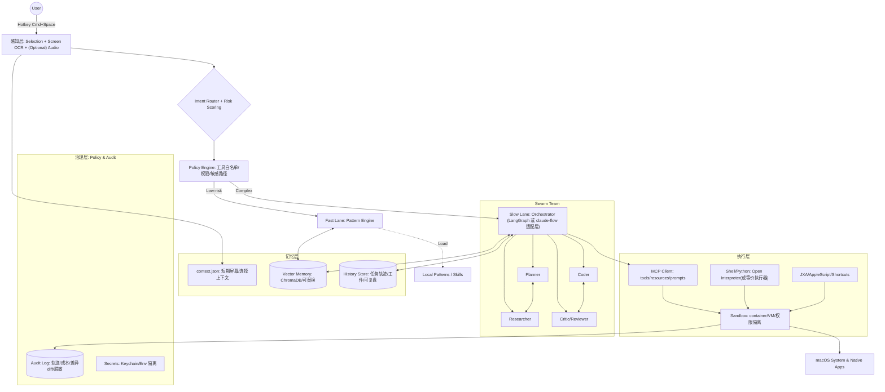

# MacCortex

**项目代号：MacCortex**  
**标题：下一代 macOS 个人智能基础设施（Personal AI Infrastructure）架构设计方案**  
**文档类型：白皮书（Whitepaper）/ 立项计划书 / 开源仓库架构说明（README_ARCH.md）**

---

## 元信息

| 属性 | 值 |
|---|---|
| 文档版本 | v1.1 (Architecture Design) |
| 最后更新 | 2026-01-20（修正 Sandbox 策略矛盾，增加 Phase 0.5） |
| 项目状态 | Phase 0.5 实施中（签名与公证基础设施） |
| 目标平台 | macOS（优先利用原生 Vision / Shortcuts / AppleScript / Keychain 等能力） |
| 核心理念 | 融合 **Swarm Intelligence（蜂群智能）** 与 **Personal Infrastructure（个人基建）** |
| 设计关键词 | Local-first、Human-in-the-loop、安全可审计、可替换组件、可进化能力库 |
| 分发策略 | **非 App Sandbox 架构**（独立分发，Homebrew Cask + 官网下载）⚠️ |

> **定位一句话**：MacCortex 不是“另一个聊天窗口”，而是一套可插拔的 macOS 原生智能基础设施：能看见屏幕、能调用工具、能自我纠错、能长期记住你，并且把危险动作锁在笼子里。

---

## 目录

- [1. 执行摘要](#1-执行摘要)
- [2. 背景与问题陈述](#2-背景与问题陈述)
- [3. 设计目标与非目标](#3-设计目标与非目标)
- [4. 系统总览](#4-系统总览)
- [5. 核心模块设计](#5-核心模块设计)
- [6. 关键使用场景](#6-关键使用场景)
- [7. 技术栈与可替换组件](#7-技术栈与可替换组件)
- [8. 安全模型与隐私策略](#8-安全模型与隐私策略)
- [9. 可观测性与质量保障](#9-可观测性与质量保障)
- [10. 实施路线图与里程碑](#10-实施路线图与里程碑)
- [11. 风险评估与对策](#11-风险评估与对策)
- [12. 开放问题](#12-开放问题)
- [附录 A：建议目录结构](#附录-a建议目录结构)
- [附录 B：Context 与 Policy 示例](#附录-bcontext-与-policy-示例)
- [附录 C：架构决策记录（ADR）](#附录-c架构决策记录adr)
- [参考与上游项目](#参考与上游项目)

---

## 1. 执行摘要

当前 AI Agent 生态出现了一个很典型的断裂：

- **蜂群/多代理编排（Swarm）**能把复杂任务拆分给多个角色并迭代纠错，但常常缺乏对用户本地环境的“感知”和对危险动作的“治理”。典型代表是 **claude-flow** 这一类“多代理编排平台”。
- **个人基建/模式化 Prompt（Personal Infrastructure + Patterns）**能把常用工作流程沉淀为模块化技能与模板，适合高频单点任务，但对“长程任务 + 工具执行 + 自我反思”支持不足。典型代表是 **Personal AI Infrastructure（PAI）**与 **Fabric Patterns**。

**MacCortex 的目标**：在 macOS 上实现一个“感知 → 决策 → 执行”的闭环系统。

- 在**简单任务**上做到：低延迟、低成本、强确定性（Pattern Fast Lane）。
- 在**复杂任务**上做到：可编排、可循环自纠错、可中断恢复（Swarm Slow Lane）。
- 在**系统执行**上做到：最小权限、逐级授权、全程审计（Policy + Sandbox + Audit）。

> **重要说明**：
> - 本文档为 v1.1 架构设计稿（2026-01-20 更新）
> - 当前状态：**Phase 0.5 实施中**（签名、公证、权限管理基础设施）
> - 架构决策：采用 **非 App Sandbox** 架构（见 ADR-001）
> - 涉及的模型、框架与工具链均为"可替换组件"，不把任何单一供应商绑定成不可替换依赖

---

## 2. 背景与问题陈述

基于你提供的调研结论（awesome-ai-agents、awesome-claude-code 等大规模生态汇总），我们将问题压缩为三个“断层”（Gap）：

### 2.1 认知断层（Cognitive Gap）

- **Prompt 模式**对多步任务（写代码、运行、修复、再运行）天然吃力。
- **复杂多代理框架**对“总结/提取/格式转换”等轻任务往往过重：启动慢、交互冗长、成本高。

**需求结论**：需要一个能自动切换“快思考/慢思考”的 **双模大脑**（Dual-Mode Brain）。

### 2.2 感知断层（Sensory Gap）

- 大多数 AI 工具“住在浏览器里”，对你当前屏幕内容、选中文本、活跃 App、上下文状态缺乏原生理解。

**需求结论**：macOS 上必须有一个高质量的 **上下文捕获层**（Screen/Selection/Audio as Context）。

### 2.3 行动断层（Action Gap）

- 很多系统停留在“建议”，但无法安全地执行：移动文件、生成项目、写入 Notes、整理日程。

**需求结论**：必须具备 **工具执行能力**，同时引入 **人机回环（Human-in-the-loop）**与 **策略治理（Policy）**，避免“AI 一句话删库跑路”。

---

## 3. 设计目标与非目标

### 3.1 设计目标（Goals）

1. **双通道决策**：Router 将任务分配到 Fast Lane（Pattern）或 Slow Lane（Swarm）。
2. **Local-first**：默认本地处理；云端仅在需要更强推理/编程能力时启用。
3. **可审计与可回滚**：所有工具调用、文件写入、网络访问必须留下可追溯记录。
4. **最小权限**：执行层按风险分级；写/删/外联等敏感操作强制确认或策略放行。
5. **可扩展**：通过 MCP（Model Context Protocol）或等价机制接入工具生态。
6. **可进化**：输出可沉淀为 Pattern/Skill；执行轨迹可复盘；偏好与历史可形成长期记忆。

### 3.2 非目标（Non-goals）

- 不追求“全自动、零确认”的系统级自动化（至少 v1 不做）。
- 不把“持续监听/全程录屏”作为默认能力（隐私风险极高，只作为可选功能）。
- 不承诺成为“通用 AGI 操作系统”；聚焦可控、可用、可维护的个人生产力基础设施。

---

## 4. 系统总览

### 4.1 架构原则

- **分层清晰**：感知（Input）/ 决策（Brain）/ 记忆（Infrastructure）/ 执行（Hands）/ 治理（Policy & Audit）。
- **状态显式**：Slow Lane 必须是有状态的工作流（支持循环、检查点、暂停/恢复）。
- **工具隔离**：执行层永远视为“危险区域”，默认在沙箱内运行。

### 4.2 架构全景图（v1.0）



---

## 5. 核心模块设计

本节按层说明：输入、路由、快思考、慢思考、记忆、执行、扩展。

### 5.1 L1 感知层（Input）

**目标**：替代“纯文本输入”，把用户当前工作上下文注入系统。

**能力清单（v1）**

- **Selection Capture**：读取当前选中文本（优先）。
  - ⚠️ **需要权限**：macOS **Accessibility 权限**（系统偏好设置 → 隐私与安全性 → 辅助功能）
  - 实现方式：`AXUIElement` API（macOS 原生无障碍 API）
  - 降级策略：用户拒绝授权时回退到"手动复制文本"模式
- **Screen Snapshot + OCR（可选）**：对当前活动窗口/屏幕区域截图，使用 macOS 原生 OCR（Vision 框架）提取文本。
  - ⚠️ **需要权限**：macOS **Screen Recording 权限**（可选功能，默认关闭）
- **App/Workspace Context**：当前前台应用、窗口标题、路径（若在 Terminal/IDE）。
- **(Optional) Audio**：语音输入/关键词唤醒（默认关闭，避免隐私与电量问题）。

**权限授权策略（关键用户体验设计）**

MacCortex 首次启动需要 **两个敏感权限**：
1. **Full Disk Access**（读取文件系统/Notes）- Phase 0.5 已实现
2. **Accessibility**（读取选中文本）- Phase 2 实现

为降低用户流失率，采用 **统一授权引导**：
- 在同一个 UI 流程中说明两个权限的用途
- 提供 15 秒演示视频（一次性展示所有授权步骤）
- 支持"稍后授权"（进入降级模式）

**输出**：写入 `context.json`（短期上下文），供 Router/Pattern/Swarm 使用。

> 可靠性原则：感知层不直接触发执行；只生成"上下文"，让决策层可控地调用。

---

### 5.2 L2 中枢层（Brain）：Router + Policy

#### 5.2.1 Router：意图识别与风险分级

Router 做两件事：

1. **Intent 分类**（总结/提取/写代码/调研/系统操作/安全分析等）
2. **Risk 分级**（只读/写入/删除/外联/权限敏感）

**实现策略（建议 v1）**

- 优先使用**本地小模型**或轻量规则进行路由（减少成本、避免泄露敏感上下文）。
- 对高风险意图（文件写入、删除、网络请求、系统设置修改）提高阈值，尽量要求明确指令与二次确认。

#### 5.2.2 Policy Engine：工具治理与权限系统

Policy Engine 是 MacCortex 的“法律系统”。它决定 **允许什么工具在什么条件下运行**。

建议的风险分级：

- **R0（Read-only）**：读取文件、列目录、读取 Notes、只读搜索。
- **R1（Write）**：写文件、重命名/移动、写入 Notes。
- **R2（Destructive）**：删除、覆盖、批量修改、改系统设置。
- **R3（Exfiltration）**：外发网络请求、上传文件、调用第三方 API。

策略建议：

- R0：可自动执行
- R1：默认需要确认（可对特定目录/应用放行）
- R2/R3：默认禁止，或必须手动输入确认短语（并提供 dry-run/diff）

---

### 5.3 Fast Lane：Pattern Engine（Fabric/PAI 的“积木区”）

**定位**：把高频任务固化为可版本化、可复用、可审计的模式。

#### 5.3.1 Pattern 规范

- Pattern 使用 **Markdown** 表达结构化指令（易读、易改、可代码审查）。
- Pattern 分为：`system.md`（核心指令）+ 可选 `example.md`/`tests.md`。

#### 5.3.2 运行模型

- 默认：本地模型（隐私优先、成本可控）
- 可选：云端模型（当 Pattern 需要更强写作/推理能力时）

#### 5.3.3 Pattern 质量控制

- 每个 Pattern 应有：
  - 输入约束（输入类型、长度、来源）
  - 输出契约（Markdown/JSON/表格等）
  - 最少一组回归测试样例（避免“改模板后输出崩坏”）

---

### 5.4 Slow Lane：Swarm Engine（复杂任务编排与自纠错）

**定位**：处理“长程任务 + 工具调用 + 多轮修正”的任务。

#### 5.4.1 工作流内核：Plan → Execute → Reflect（循环图）

Slow Lane 必须是**可循环**的，而不是一次性链式调用。

- **Planner**：拆解任务，定义验收条件。
- **Executor（Researcher/Coder/Tool Runner）**：执行子任务、调用工具。
- **Reflector/Reviewer**：检查完整性与正确性；不满足则回退继续。
- **Stop Conditions**：最大迭代次数、预算上限、时间上限、用户中断。

#### 5.4.2 Orchestrator 实现的两条路线

> 这是一个关键的“可靠性决策”：不同团队偏好不同。

- **路线 A：LangGraph（Python 生态）**
  - 适合你想要强控制、可视化状态机、断点恢复、Human-in-the-loop（可中断等待用户输入）。
  - 典型场景：写代码 → 运行 → 读报错 → 修复 → 再运行。

- **路线 B：claude-flow 适配层（Node/Claude Code 生态）**
  - 适合直接复用 claude-flow 的 swarm 编排能力、工具生态与既有方法论。
  - MacCortex 只需要提供 macOS 输入层 + Policy + Audit + Context 注入。

> v1 建议策略：先选 **一条路线**做通，再做适配层兼容第二条。避免“双线开发”直接把项目拖死。

---

### 5.5 L3 记忆层（Infrastructure）：Context / Vector / History

#### 5.5.1 短期上下文（context.json）

- 只保存“当前任务必需信息”（屏幕 OCR、选择内容、活动应用、路径等）。
- 生命周期：分钟级或一次任务级，默认任务结束清空。

#### 5.5.2 长期记忆（Vector Memory）

- 存储内容：偏好、常用路径、常见任务结果、失败原因、已验证结论。
- 设计要求：
  - 可配置“哪些内容允许入库”（PII/密钥/敏感片段默认禁止）
  - 可导出/可删除（用户可控）

#### 5.5.3 历史系统（History Store）

- 保存：任务轨迹、工具调用、文件变更 diff、关键中间产物。
- 目标：可复盘、可复用、可做回归测试数据集。

---

### 5.6 L4 执行层（Execution）：Shell / macOS Bridge / Sandbox

#### 5.6.1 Shell 执行（推荐：Open Interpreter 或等价执行器）

- 执行器负责：
  - 运行 Python/Bash/Node 等
  - 捕获 stdout/stderr
  - 将错误回传给 SwarmEngine 进入修复循环

#### 5.6.2 macOS 原生 App 控制（Bridge）

- 采用 JXA/AppleScript/Shortcuts 的方式对 Notes/Mail/Calendar/Finder 等进行可控操作。
- 所有动作必须输出“将做什么”的摘要，并进入 Policy 审批。

#### 5.6.3 权限策略（非 Sandbox 架构）⚠️

> **重要架构决策（ADR-001）**：MacCortex 采用 **非 App Sandbox 架构**，原因：
> - Full Disk Access 权限与 App Sandbox 互斥（macOS 限制）
> - JXA/AppleScript 控制 Notes/Mail/Finder 需要非 Sandbox 环境
> - 决策日期：2026-01-20（Phase 0.5 实施过程中确定）

**三重防护机制（替代 Sandbox）**

1. **Hardened Runtime**：代码签名 + Entitlements 严格限制
2. **Policy Engine**：R0-R3 风险分级 + 工具白名单
3. **受控目录**：默认只允许在 Workspace 内写入

**文件访问策略**
- ✅ **允许读取**：`~/MacCortexWorkspace/**`、用户授权的 Full Disk Access 路径
- ⚠️ **需确认写入**：`~/MacCortexWorkspace/**`（默认需 dry-run/diff 预览）
- ❌ **禁止写入**：`/System`、`/Library`、`/usr`、`~/.ssh`、`~/Library/Keychains`

**符号链接防护**
- 所有文件操作前解析真实路径（`realpath`）
- 拒绝指向禁止区域的符号链接

---

### 5.7 扩展层：MCP（可选但强烈建议）

MCP（Model Context Protocol）是将“工具/资源/提示”以标准方式接入 LLM 应用的协议生态。

**MacCortex 的用法**

- 把外部工具（搜索、GitHub、数据库、笔记系统、内部服务）统一封装成 MCP Servers
- Brain/Swarm 通过 MCP Client 发现、调用工具

**安全注意事项**

- MCP Server 视为潜在恶意代码来源；必须纳入供应链信任与权限隔离。
- 禁止“未知来源 server”默认拥有文件系统读写权限。

---

## 6. 关键使用场景

| 场景分类 | 用户指令示例 | 处理路径 | 预期动作 |
|---|---|---|---|
| 信息处理 | “总结这篇 PDF 的核心观点，用这种语气…” | Fast Lane（Pattern） | 读取选中文本/段落 → 运行 `summarize_*` Pattern → 输出 Markdown |
| 复杂调研 | “研究吉隆坡最好的 3 家私立医院，做成对比表格存入 Notes” | Slow Lane（Swarm） | Research → 提取结构化字段 → 表格化 → Bridge 写入 Notes |
| 系统操作 | “把 Downloads 里所有 png 移到 Images” | Execution（受控） | 生成 shell 脚本 → dry-run 预览 → 用户确认 → 执行 |
| 编程开发 | “写一个贪吃蛇游戏，运行看看” | Slow Lane（Swarm） | Coder 写代码 → 执行器运行 → 读报错 → 修复 → 通过验收 |
| 安全工作流（可选） | “对这个仓库做一次快速威胁建模并输出 checklist” | Fast/Slow 皆可 | Pattern 输出模板 +（可选）Swarm 拉取代码结构并补充 |

---

## 7. 技术栈与可替换组件

> 原则：每层至少有一个“可替换方案”，避免被单点绑定。

### 7.1 建议技术栈（v1 推荐）

- **核心语言**：Python 3.10+（编排、工具调用、数据处理）
- **编排**：LangGraph（Slow Lane 候选）或 claude-flow（生态复用路线）
- **模型接入**：
  - 云端：Anthropic Claude（用于复杂编程/推理）
  - 本地：Ollama（路由、隐私、轻任务）
- **向量库**：ChromaDB（本地优先，可替换）
- **GUI**：
  - 轻量优先：Raycast Extension / SwiftUI
  - 跨平台：Electron / PyQt（成本更高）
- **macOS 系统交互**：pyobjc + AppleScript/JXA/Shortcuts
- **工具生态**：MCP（可选但建议）

### 7.2 组件替换清单（示例）

- VectorDB：Chroma / SQLite + embeddings / 其他向量库
- Orchestrator：LangGraph / claude-flow / 自研状态机
- GUI：SwiftUI / Raycast / Electron
- Execution Sandbox：Docker / Lima(轻 VM) / macOS Sandbox（视可行性）

---

## 8. 安全模型与隐私策略

### 8.1 威胁模型（Threat Model）

MacCortex 的风险与传统 App 不同：它会“读上下文 + 调工具 + 写系统”。主要攻击面：

1. **Prompt Injection**：来自网页、PDF、OCR 文本的恶意指令诱导工具执行。
2. **工具滥用**：模型生成危险命令（rm、覆盖系统目录、外发敏感文件）。
3. **供应链/插件风险**：不可信 MCP server/脚本依赖导致执行恶意代码。
4. **数据泄露**：context、日志、记忆库不当存储导致隐私泄露。

### 8.2 核心防护机制（v1 必须具备）

- **Policy Engine（强制）**：所有工具调用必须先过策略层。
- **Human-in-the-loop（强制）**：写/删/外联默认需要确认。
- **Dry-run / Diff Preview（强制）**：文件变更必须先展示差异。
- **最小权限 + 受控目录（强制）**：默认只允许在 Workspace 内写。
- **Secrets 隔离（强制）**：API Key 存 Keychain，日志永不落盘密钥。
- **审计日志（强制）**：谁在何时触发了哪个工具、改了什么文件。

### 8.3 隐私策略（Local-first）

- **默认本地**：路由、轻任务、索引尽量本地完成。
- **云端最小化**：只上传“完成任务必需片段”；敏感上下文默认脱敏/不上传。
- **可删除权**：用户可以一键清除短期上下文、长期记忆与历史轨迹。

---

## 9. 可观测性与质量保障

### 9.1 可观测性（Observability）

- 记录：
  - 每次任务的路由决策（Fast/Slow + 原因）
  - 工具调用链与耗时
  - token/成本（云端）
  - 输出质量标注（用户反馈/自动检查）

### 9.2 质量保障（Testing）

- **Pattern 回归测试**：固定输入 → 固定结构输出（允许内容变化，但结构要稳）。
- **工具安全测试**：对常见注入样例做拦截验证。
- **端到端验收用例**：四类场景至少各 3 个可重复的测试任务。

---

## 10. 实施路线图与里程碑

> 原则：每一阶段都必须有可运行交付物；禁止"先造大城堡再装门"。

### Phase 0.5：macOS 签名与公证基础设施 ✨ **[当前进行中]**

> **重要性**：生产级分发能力是所有后续 Phase 的先决条件。Phase 0.5 确保应用能通过 Gatekeeper，合法获取系统权限，并支持自动更新。

**交付物（10天工期：2026-01-20 ~ 2026-01-27）**
- ✅ Developer ID 签名 + Hardened Runtime 配置（`MacCortex.entitlements`）
- ✅ Apple 公证自动化（`xcrun notarytool` + GitHub Actions CI/CD）
- ✅ Full Disk Access 权限管理（`PermissionsKit` Swift Package）
- ✅ Sparkle 2 自动更新集成（EdDSA 签名）
- ✅ 首次启动授权 UI（SwiftUI `FirstRunView`）
- ✅ 用户教育资源（FAQ + 60秒演示视频脚本）

**Phase 0.5 验收标准（P0 阻塞性，必须 100% 通过）**

| # | 验收项 | 测试命令 | 期望结果 | 状态 |
|---|--------|----------|----------|------|
| 1 | **签名验证** | `spctl --assess --type execute MacCortex.app` | 输出: `accepted` | ⏳ Day 3 |
| 2 | **公证成功** | `xcrun stapler validate MacCortex.dmg` | 输出: `validate action worked` | ⏳ Day 4 |
| 3 | **Gatekeeper 放行** | 下载 DMG → 双击安装 → 打开 | 无安全警告，直接启动 | ⏳ Day 4 |
| 4 | **授权流程** | 首次启动 → 引导 → 授权 FDA + Accessibility | 总耗时 < 60 秒 | ⏳ Day 8 |
| 5 | **Sparkle 检测** | 应用内「检查更新」 | 显示更新状态 | ⏳ Day 10 |

**关键架构决策（ADR-001）**
- ❌ **不采用 App Sandbox**：Full Disk Access 与 App Sandbox 互斥
- ✅ **采用非 Sandbox 架构**：Hardened Runtime + Policy Engine + 受控目录
- ✅ **独立分发**：非 App Store，Homebrew Cask + 官网直接下载
- ✅ **权限策略**：FDA（必需）+ Accessibility（可选但推荐）

**Phase 0.5 完成后解锁**
- ✅ 应用可在任意 macOS 设备安全分发
- ✅ 用户可授权 Full Disk Access（访问文件系统/Notes）
- ✅ 自动更新机制就绪（无需用户手动下载）
- ✅ 为 Phase 1-4 扫清所有分发与权限障碍

---

### Phase 0：工程基座（Foundation）

**交付**
- 项目骨架 + 日志/审计 + secrets 管理
- `context.json` 生成与读取

**验收**
- 任意一次运行都能生成可读的 trace（包括路由结果与工具调用）

### Phase 1：MVP（Fabric Clone / Pattern CLI）

**交付**
- `cortex pattern <name>`：加载 Pattern，处理 stdin
- 输出工件落盘（Markdown + 元数据）

**验收**
- 支持：`echo "text" | cortex pattern extract_wisdom`

### Phase 2：Desktop Eyes（GUI + Context 注入）

**交付**
- Spotlight 风格输入框（或 Raycast Extension）
- 选中文本 + OCR 注入 context
- **Accessibility 权限授权流程**（与 Phase 0.5 FDA 权限合并引导）
- 降级模式实现（用户拒绝 Accessibility 时回退到手动复制）

**验收**
- 不手动复制内容也能完成一次 Pattern 处理
- Accessibility 授权流程 < 30 秒（与 FDA 合并后总时长 < 60 秒）
- 降级模式可用（拒绝授权后仍可通过手动复制使用 80% 功能）

### Phase 3：Hands（System Control + 安全回环）

**交付**
- Shell 执行器接入
- 文件移动/重命名等 R1 级操作可执行
- 默认确认机制 + dry-run/diff

**验收**
- 完成“批量整理下载文件夹”并留下可审计记录

### Phase 4：Swarm（复杂任务编排与自纠错）

**交付**
- Slow Lane 工作流（Plan/Execute/Reflect）
- Coder↔Reviewer 回路
- Stop conditions

**验收**
- 完成一个可运行的小型项目（例如游戏/CLI 工具），并通过最小测试

---

## 11. 风险评估与对策

| 风险 | 表现 | 对策 |
|---|---|---|
| 幻觉导致危险命令 | 生成 rm、覆盖、外发等 | Policy 强制拦截；R2/R3 默认禁止；dry-run/diff + 手动确认 |
| API 成本不可控 | Slow Lane 多轮消耗大 | Router 严格分流；预算上限；最大迭代；优先本地模型处理轻任务 |
| Prompt injection | OCR/网页内容诱导工具执行 | 不可信输入标记；工具调用必须由 Policy 决策；对外部内容做“指令隔离” |
| 插件/供应链风险 | MCP server/依赖被投毒 | 只装可信源；版本锁定；最小权限；沙箱执行；审计 |
| 隐私泄露 | context/日志/记忆保存不当 | 默认本地；脱敏；可删除；密钥永不落盘 |

---

## 12. 开放问题

1. GUI 选型：SwiftUI/Raycast/Electron 哪个更符合“轻量长期维护”？
2. 执行沙箱：Docker vs Lima vs 原生 Sandbox，哪种在 macOS 上体验与隔离最佳？
3. 记忆策略：哪些内容允许长期存？如何提供“记忆可解释性”和“一键遗忘”？
4. 多模型策略：Router 用本地模型时，如何保证分类稳定性？需要多少标注数据？
5. 插件治理：MCP server 的信任、签名、权限声明机制如何落地？

---

## 附录 A：建议目录结构

```text
MacCortex/
  apps/
    macos-ui/                 # SwiftUI/Raycast/Electron GUI
  core/
    router/                   # intent + risk scoring
    policy/                   # policies, allowlists, approvals
    patterns/                 # local patterns (Markdown)
    orchestration/            # slow lane graphs / adapters
    memory/
      vector/                 # chroma client
      history/                # traces, artifacts
    tools/
      shell/                  # execution wrapper
      macos/                  # applescript/jxa/shortcuts
      mcp/                    # mcp client integration
  configs/
    policy.yaml
    models.yaml
    logging.yaml
  workspace/                  # default safe write directory
  docs/
    README_ARCH.md
```

---

## 附录 B：Context 与 Policy 示例

### B.1 context.json（示例）

```json
{
  "timestamp": "2026-01-19T00:00:00Z",
  "active_app": "Terminal",
  "window_title": "~/project-x",
  "selection_text": "...",
  "screen_ocr_text": "...",
  "workspace_path": "/Users/you/MacCortexWorkspace/project-x",
  "sensitivity": {
    "contains_secrets": false,
    "contains_personal_data": true
  }
}
```

### B.2 policy.yaml（示例）

```yaml
rules:
  - id: allow_read_workspace
    risk: R0
    tools: ["fs.read", "fs.list", "notes.read"]
    paths:
      - "~/MacCortexWorkspace/**"

  - id: require_confirm_write_workspace
    risk: R1
    tools: ["fs.write", "fs.move", "notes.write"]
    paths:
      - "~/MacCortexWorkspace/**"
    require_user_confirmation: true

  - id: deny_system_paths
    risk: R2
    tools: ["fs.delete", "fs.write", "sys.settings"]
    paths:
      - "/System/**"
      - "/Library/**"
      - "/**"
    action: deny
```

---

## 附录 C：架构决策记录（ADR）

> Architecture Decision Records - 记录关键技术决策的理由、影响与权衡

### ADR-001: 采用非 Sandbox 架构（2026-01-20）

**背景**
- MacCortex 需要 Full Disk Access（读取文件系统/Notes/日历等）
- 需要通过 JXA/AppleScript 控制 macOS 原生应用（Notes/Mail/Finder）

**决策**
- ❌ **不采用 App Sandbox**
- ✅ **采用 Hardened Runtime + Policy Engine + 受控目录**

**理由**
1. **技术限制**：Full Disk Access 与 App Sandbox 互斥（macOS 系统限制）
2. **功能需求**：JXA/AppleScript 在 Sandbox 内完全无法控制其他应用
3. **安全替代方案**：三重防护（Hardened Runtime + Policy Engine + 受控目录）可达到同等安全级别

**影响**
- ✅ 核心功能完整（Notes 访问、批量文件操作、系统自动化）
- ❌ 无法上架 Mac App Store（只能独立分发）
- ✅ 可通过 Homebrew Cask、官网直接下载分发
- ⚠️ 需要用户授权 Full Disk Access（敏感权限，需优秀的引导 UI）

**验证**
- Phase 0.5 实施过程中验证（2026-01-20 ~ 2026-01-27）
- 成功案例：Raycast、Homebrew、Docker Desktop 均采用非 Sandbox 架构

**状态**：✅ 已确认并实施

---

### ADR-002: 优先采用 LangGraph 作为 Swarm 编排引擎（建议）

**背景**
- 文档提出两条路线：LangGraph（Python）vs claude-flow（Node.js）
- 需要在 Phase 4 前明确选择

**建议决策**
- ✅ **优先 LangGraph**
- 🔄 **claude-flow 作为 Phase 4 后的可选适配层**

**理由**
1. **技术栈一致性**：Phase 0.5 已用 Python/Swift，LangGraph（Python）无缝集成
2. **Human-in-the-loop 原生支持**：LangGraph 的 `interrupt` 机制成熟（见 CLAUDE.md 证据清单）
3. **MLX 集成**：与本地 MLX 模型（Phase 3+）Python 原生对接
4. **状态持久化**：LangGraph 的检查点/断点恢复能力更强
5. **生态成熟度**：LangChain 生态（工具/Agent/记忆管理）可复用

**权衡**
- ❌ claude-flow 的 87 个 MCP 工具生态无法直接复用
- ✅ 但可通过 MCP Client（Python）接入相同的 MCP Servers
- ⚠️ 团队需学习 LangGraph 状态图设计（学习曲线约 1-2 周）

**影响**
- Phase 4 工期保持 6 周（LangGraph 学习 + 编排实现 + 测试）
- Phase 5（可选）可增加 claude-flow 适配层，支持 Node.js 工具生态

**状态**：💬 待最终确认（建议在 Phase 3 结束前决策）

---

### ADR-003: Accessibility + Full Disk Access 统一授权引导（建议）

**背景**
- MacCortex 需要两个敏感权限：FDA（必需）+ Accessibility（推荐）
- 用户对多次敏感权限请求的容忍度低（拒绝率可能达 30-40%）

**建议决策**
- ✅ **在首次启动时统一说明两个权限**
- ✅ **提供 15 秒演示视频（一次性展示所有步骤）**
- ✅ **支持"稍后授权"降级模式**

**理由**
1. **用户体验**：一次性讲清楚胜过分两次打扰
2. **转化率优化**：降低"第二次被拒绝"的概率
3. **降级友好**：拒绝 Accessibility 仍可用 80% 功能（手动复制模式）

**影响**
- Phase 0.5 实现 FDA 授权 UI
- Phase 2 增强 UI，合并 Accessibility 授权说明
- Phase 2 验收标准：两个权限授权总时长 < 60 秒

**状态**：💬 待 Phase 2 实施（2026-01 下旬）

---

## 参考与上游项目

> 以下链接用于“可验证事实来源”。本项目不隶属于这些上游仓库；MacCortex 是一个独立的架构设计与实现计划。

- claude-flow（Swarm 编排生态）
  - https://github.com/ruvnet/claude-flow
  - https://github.com/ruvnet/claude-flow/wiki

- Personal AI Infrastructure（个人基建框架）
  - https://github.com/danielmiessler/Personal_AI_Infrastructure

- Fabric（Patterns/Prompt 模式库）
  - https://github.com/danielmiessler/Fabric

- LangGraph（循环图/状态机编排）
  - https://github.com/langchain-ai/langgraph
  - https://docs.langchain.com/oss/python/langgraph/overview

- Open Interpreter（工具执行/代码运行）
  - https://github.com/openinterpreter/open-interpreter
  - https://docs.openinterpreter.com/

- MCP（Model Context Protocol）
  - https://modelcontextprotocol.io/
  - https://github.com/modelcontextprotocol/servers

- Chroma（本地向量检索/记忆存储候选）
  - https://github.com/chroma-core/chroma

- Ollama（本地模型运行候选）
  - https://github.com/ollama/ollama

---

**文档维护记录**

- ✅ **v1.1 (2026-01-20)**：修正 Sandbox 策略矛盾，增加 Phase 0.5 里程碑，新增附录 C（ADR）
- 📋 **v1.2（待定）**：补"路由与策略决策的可解释性"（为什么走 Fast/Slow、为什么拒绝工具）
- 📋 **v1.3（待定）**：补"插件权限声明（capabilities）与签名机制"
- 📋 **v1.4（待定）**：补"评估基准（Benchmark tasks）与安全测试集"

**v1.1 主要变更（2026-01-20）**

| 变更类型 | 章节 | 内容 |
|---------|------|------|
| 🔴 **修正矛盾** | 5.6.3 | 删除 Sandbox 强制要求，改为"非 Sandbox + 三重防护" |
| ⚠️ **补充缺失** | 5.1 | 增加 Accessibility 权限说明与降级策略 |
| ✨ **新增里程碑** | 10 | 插入 Phase 0.5（签名与公证基础设施） |
| 📋 **架构决策** | 附录 C | 新增 ADR-001（非 Sandbox）、ADR-002（LangGraph）、ADR-003（统一授权） |
| 📝 **元信息更新** | 元信息表 | 版本 v1.0 → v1.1，增加"分发策略"行 |
